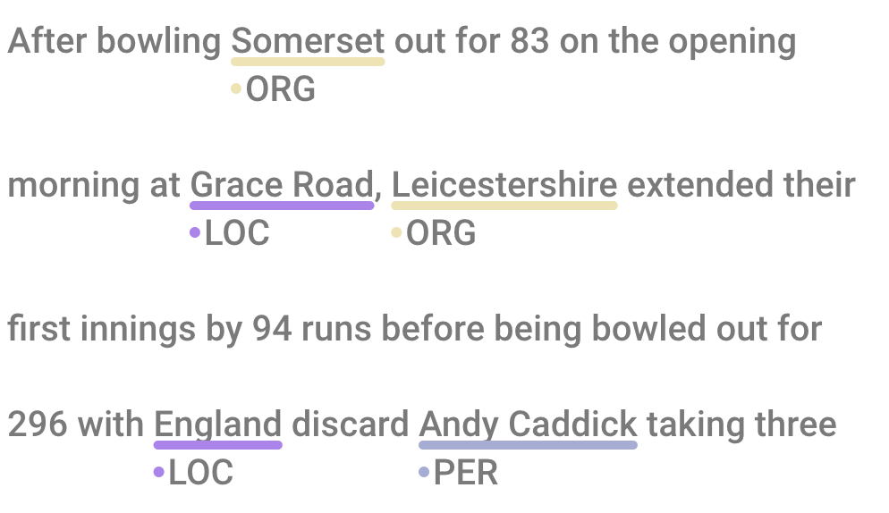

# react-span-annotator

React component for annotating text with named entities and relations.



## Install

```bash
npm install react-span-annotator
# peer deps
npm install react react-dom
```

## Quick start

```tsx
import { useState } from 'react';
import { ReactSpanAnnotator } from 'react-span-annotator';
import type { Entity, Label, Relation } from 'react-span-annotator';

const text = 'Tokyo is the capital of Japan.';

const entityLabels: Label[] = [
  { id: 1, text: 'Location', color: '#ff9999' },
];

export default function App() {
  const [entities, setEntities] = useState<Entity[]>([
    new Entity(1, 1, 0, 5),   // "Tokyo"
    new Entity(2, 1, 24, 29), // "Japan"
  ]);

  const handleAddEntity = (_event: Event, start: number, end: number) => {
    const id = Date.now();
    setEntities((prev) => [...prev, new Entity(id, 1, start, end)]);
  };

  return (
    <ReactSpanAnnotator
      text={text}
      entities={entities}
      entityLabels={entityLabels}
      onAddEntity={handleAddEntity}
    />
  );
}
```

## Props

### Required

| Prop | Type | Description |
|------|------|-------------|
| `text` | `string` | The text to annotate |
| `entities` | `Entity[]` | Array of entity annotations |
| `entityLabels` | `Label[]` | Label definitions for entities |

### Optional

| Prop | Type | Default | Description |
|------|------|---------|-------------|
| `relations` | `Relation[]` | `[]` | Relation annotations between entities |
| `relationLabels` | `Label[]` | `[]` | Label definitions for relations |
| `selectedEntities` | `Entity[]` | `[]` | Entities to highlight |
| `maxLabelLength` | `number` | `12` | Max chars shown in label badge before truncation |
| `allowOverlapping` | `boolean` | `false` | Allow overlapping entity spans |
| `rtl` | `boolean` | `false` | Right-to-left text direction |
| `graphemeMode` | `boolean` | `true` | Use grapheme clusters for offsets (handles emoji, CJK correctly) |
| `dark` | `boolean` | `false` | Dark mode (relation label background) |
| `height` | `number` | `window.innerHeight` | Height of the virtual scroll container in px |

### Callbacks

| Prop | Signature | Description |
|------|-----------|-------------|
| `onAddEntity` | `(event, startOffset, endOffset) => void` | Fired when user selects text |
| `onClickEntity` | `(event, entityId) => void` | Fired on entity click |
| `onClickRelation` | `(event, relation) => void` | Fired on relation click |
| `onContextmenuEntity` | `(entity) => void` | Fired on entity right-click |
| `onContextmenuRelation` | `(relation) => void` | Fired on relation right-click |

## Data types

### Entity

```ts
import { Entity } from 'react-span-annotator';

new Entity(
  id: number,           // unique id
  label: number,        // id of the Label
  startOffset: number,  // start char offset (inclusive)
  endOffset: number     // end char offset (exclusive)
)
```

### Label

```ts
interface Label {
  id: number;
  text: string;
  color?: string;           // used for entities
  backgroundColor?: string; // alternative to color
}
```

### Relation

```ts
interface Relation {
  id: number;
  labelId: number; // id of the Label
  fromId: number;  // id of the source Entity
  toId: number;    // id of the target Entity
}
```

## Example with relations

```tsx
import { ReactSpanAnnotator } from 'react-span-annotator';
import type { Entity, Label, Relation } from 'react-span-annotator';

const text = 'Alice knows Bob.';

const entities: Entity[] = [
  new Entity(1, 1, 0, 5),  // "Alice"
  new Entity(2, 1, 13, 16), // "Bob"
];

const entityLabels: Label[] = [
  { id: 1, text: 'Person', color: '#a0c4ff' },
];

const relations: Relation[] = [
  { id: 1, labelId: 1, fromId: 1, toId: 2 },
];

const relationLabels: Label[] = [
  { id: 1, text: 'knows', color: '#74b8dc' },
];

export default function App() {
  return (
    <ReactSpanAnnotator
      text={text}
      entities={entities}
      entityLabels={entityLabels}
      relations={relations}
      relationLabels={relationLabels}
    />
  );
}
```

## Development

```bash
npm install
npm run dev       # start Vite dev server
npm run test:unit # run unit tests
npm run lint      # lint src
```

## License

MIT
